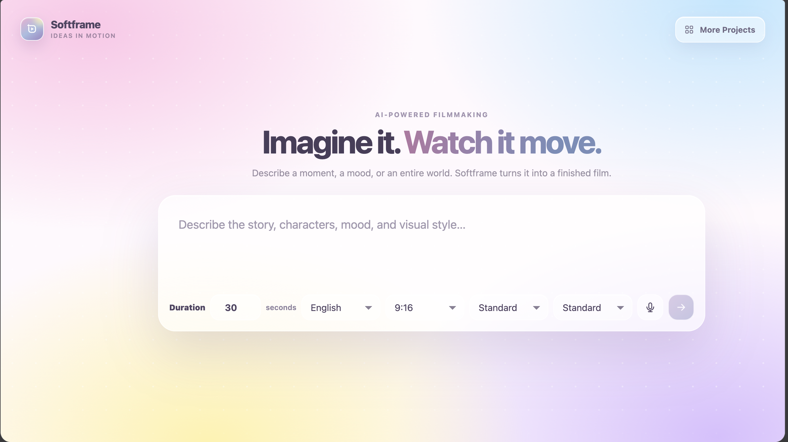

# Magnific Video Automation Agent

A LangGraph pipeline that turns a story prompt into a narrated short video. It plans the story and shots, generates reference art and scene media, validates each stage, assembles a rough cut, and produces the final edit.

## Demo

**WORK IN PROGRESS**



[Watch the robot story demo](https://raw.githubusercontent.com/Nehainit/Text_to_video_multi_agent_system/main/demo/robot-story.mp4) — 17 seconds, 1080×1920, H.264/AAC.

## Pipeline

```text
Prompt → safety check → story → narration → scenes → visual beats → shots
→ reference art → storyboard → image QA → motion → shot videos
→ video validation → edit timeline → rough cut → combined judge
→ subtitles → final edit
```

Human review checkpoints and SQLite persistence allow interrupted runs to be reviewed or resumed. Detailed agent contracts are in [`docs/agents`](docs/agents/README.md).

## Project structure

```text
video_automation/        Python application package
  agents/                Pipeline agents, judges, validators, and media assembly
  agent_graph.py         LangGraph orchestration
  backend.py             FastAPI entrypoint
  main.py                Interactive CLI entrypoint
  models.py              Model-provider adapters
  prompts.py             Prompt/config loader
  schema.py              Shared state and validation
tests/                   Automated tests
config/                  Prompt and runtime YAML configuration
docs/agents/             Agent contracts
frontend/                Browser UI
assets/                  Bundled reference assets
demo/                    Example generated video
```

## Technology stack

- **Orchestration:** LangGraph with human-review interrupts and SQLite checkpoints
- **API and UI:** FastAPI, Uvicorn, and a dependency-free HTML/CSS/JavaScript frontend
- **LLMs:** Ollama/LangChain Ollama, Hugging Face Inference, Gemini, or Groq
- **Media generation:** Magnific image/video APIs and ElevenLabs narration
- **Media processing:** FFmpeg, ffprobe, and Pillow
- **Storage:** local artifacts with optional MinIO publishing
- **Configuration:** YAML plus environment variables loaded by python-dotenv

## Parallel processing

The pipeline uses Python's standard-library `ThreadPoolExecutor` for the network-bound generation stages:

- **Shot images:** `IMAGE_GENERATION_WORKERS` defaults to 2 and is clamped to 1–4. Independent shots run concurrently; shots with `previous_shot_id` continuity dependencies wait for their predecessor.
- **Shot videos:** `VIDEO_GENERATION_WORKERS` defaults to 3 and is clamped to 1–4. Independent shot-video jobs run concurrently, while retries and FFmpeg fallback remain isolated per shot.

Both paths use `pool.map`, so results stay in shot order even though provider requests execute in parallel. The rest of the LangGraph workflow remains sequential because each stage consumes the previous stage's validated output.

## Requirements

- Python 3.10+
- FFmpeg and ffprobe
- Ollama with text and vision models
- Magnific API key for image/video generation
- ElevenLabs API key for narration
- MinIO only when externally reachable source media is required

## Setup

```bash
python3 -m venv .venv
source .venv/bin/activate
pip install -r requirements.txt
cp .env.example .env
```

Add your API keys to `.env`, then install the default local models:

```bash
ollama pull qwen2.5:3b-instruct
ollama pull qwen2.5vl:3b
ollama serve
```

## Run the web app

In a second terminal:

```bash
source .venv/bin/activate
python -m video_automation.backend
```

Open [http://127.0.0.1:8001](http://127.0.0.1:8001), enter a story prompt, and start generation. Artifacts are written under `outputs/<thread-id>/`.

## Run the interactive CLI

```bash
source .venv/bin/activate
python -m video_automation.main
```

## Tests

```bash
.venv/bin/python -m pytest -q
```

The suite currently contains 189 tests.
